# Sails.js

[Sails.js](http://sailsjs.org) is a powerful web framework that auto-generates REST APIs and the socket layer simultaneously.

Follow the [Getting Started](https://github.com/balderdashy/sails-docs/blob/master/getting-started/getting-started.md) docs to get started with Sails.

<table border=1>
 <tr>
 <td>Intro to Sails.js (00:14:44)<br/>
<a href="http://www.youtube.com/watch?feature=player_embedded&v=GK-tFvpIR7c" target="_blank">
</a></td>
 </tr>
</table>

## Setup `Cloud 9` Account

* Register a free account on [Cloud 9](https://c9.io).

* On the `Cloud 9` dashboard, click `CREATE NEW WORKSPACE` and select `Create a New Workspace`.


* Name your `workspace`. Select `Hosted` hosting with a `Node.js` service. Click the `CREATE` button. The create process runs for about 5 minutes... 


## How to Setup `Sails.js` on `Cloud 9`.

* In the `dashboard` click on the newly created `workspace` and click `START EDITING`.


* Open a new `Terminal Window`.


* Install `Sails.js` via the `Terminal Window`. The `NPM` package manager will install sails globally with the `-g` option.

`
sudo npm -g install sails
`


* Create a new `Sails.js` project.

```
sails new sailsDemoProject
```


* Change to the project folder and start the `Sails.js` server.

```
cd sailsDemoProject/
sails lift
```


* Find `server.js` within your project, right-click and choose `Run`.


* Running `server.js` will display the link to browse the project.


* Entering the link in the preview browser will display the project.


## Create Leaderboards Demo

Any game that has scoring will likely have a leaderboards feature. Here's how you can make a leaderboard in `Sails.js`.

* In the terminal, create a demo project. Switch to the project directory and restart `Sails.js`.

```
sails new leaderboardDemo
cd leaderboardDemo
sails lift
```


* Preview the page to confirm `Sails.js` has loaded.

```
https://sailsdemo-tgraupmann.c9.io/
```


* In the terminal create a `leaderboard` api model and restart `Sails.js`.

```
sails generate api leaderboard
sails lift
```


* The `Leaderboard.js` API model will be generated.


* Preview the leaderboard API page to verify the API has been created. The result set will be empty at first.


* Add records to the leaderboard data by hitting the API create page. More details are available on the page [Create a record](http://sailsjs.org/#/documentation/reference/blueprint-api/Create.html) in the `Blueprint API`.

```
https://sailsdemo-tgraupmann.c9.io/leaderboard/create?name=timg&score=10
```


* The leaderboard page will show data has been added.

```
https://sailsdemo-tgraupmann.c9.io/leaderboard
```


* Limit list to `10` records and sort by a descending `Score`.

```
https://sailsdemo-tgraupmann.c9.io/leaderboard?limit=10&sort=score%20DESC
```

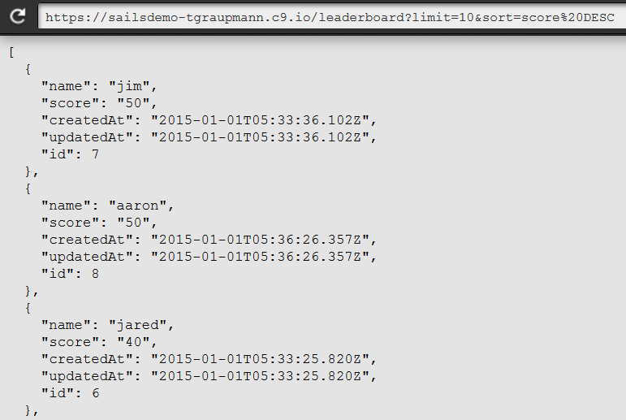

* If two people have the same score, sort by id.

```
https://sailsdemo-tgraupmann.c9.io/leaderboard?limit=10&sort=score%20DESC%20id%20ASC
```


* If two people have the same score, sort by `createdAt`.

```
https://sailsdemo-tgraupmann.c9.io/leaderboard?limit=10&sort=score%20DESC%20createdAt%20ASC
```


* To sort `Score` values properly change the `leaderboard model` attribute field for `Score` to use an `integer` type. Otherwise the `Score` values would sort in `String` order which is not ideal.

```
module.exports = {
  attributes: {
    name:{type:'string'},
    score:{type:'integer'}
  }
};
```

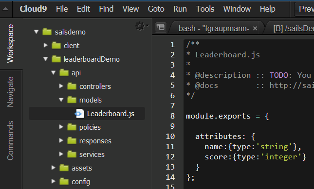

* After making a change to the model, restart `Sails.js`.

```
sails lift
``` 

* Destroy will remove a record using the "id" field. More details are available on the page [Destroy a record](http://sailsjs.org/#/documentation/reference/blueprint-api/Destroy.html) in the `Blueprint API`.

```
https://sailsdemo-tgraupmann.c9.io/leaderboard/destroy?id=1
```


## Access With `Sockets.io`

* With `Socket.io` open a socket connection.

```
var socket = io.connect("https://sailsdemo-tgraupmann.c9.io/");
```

* The `leaderboard` data is available using `Socket.io` using the socket connection to request data from the `leaderboard` page.

```
socket.request("/leaderboard", "{}", function (leaderboards) { console.log(leaderboards); });
```

## Accessing Leaderboard Data from Unity

The [UnitySailsLeaderboard](https://github.com/tgraupmann/tagenigma-examples/tree/master/UnitySailsLeaderboard) example reads the `Sails.js` leaderboard data to display using the new Unity 4.6 UI.

* Be sure to inspect the `LeaderboardManager` and in the inspector set the `Cloud9` fields for your `Username` and `Project Name`. 

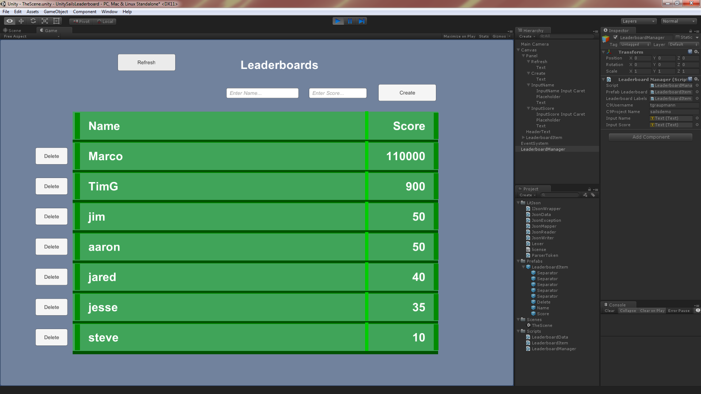

### Creating Data Over WWW

```
		public IEnumerator createData()
		{
			// get data
			string url = string.Format("https://{0}-{1}.c9.io/leaderboard/create?name={2}&score={3}", 
				_C9ProjectName, _C9Username, _InputName.text, _InputScore.text);
			WWW www = new WWW(url);
			yield return www;
			if (null != www.error)
			{
				www.Dispose ();
				yield break;
			}
			
			string jsonData = www.text;
			www.Dispose();
			Debug.Log(jsonData);
		}
```

### Destroying Data Over WWW

```
		public IEnumerator destroyData(int id)
		{
			// get data
			string url = string.Format("https://{0}-{1}.c9.io/leaderboard/destroy?id={2}",
				_C9ProjectName, _C9Username, id);
			WWW www = new WWW(url);
			yield return www;
			if (null != www.error)
			{
				www.Dispose ();
				yield break;
			}
			string jsonData = www.text;
			www.Dispose();
			Debug.Log(jsonData);
		}
```

### Reading Data Over WWW

```
		public IEnumerator requestData()
		{
			// get data
			string url = string.Format("https://{0}-{1}.c9.io/leaderboard?limit=10&sort=score%20DESC%20createdAt%20ASC",
				_C9ProjectName, _C9Username);
			WWW www = new WWW(url);
			yield return www;
			if (null != www.error)
			{
				www.Dispose ();
				yield break;
			}

			string jsonData = www.text;
			www.Dispose();
			Debug.Log(jsonData);

			LeaderboardData[] results = JsonMapper.ToObject<LeaderboardData[]>(jsonData);
		}
```

# Debugging `Sails.js` and `Socket.io`

One way to troubleshoot communication between a server and client is by using a proxy that logs communication.
[SailsDebugSocketIO](https://github.com/tgraupmann/tagenigma-examples/tree/master/SailsDebugSocketIO) is a console application that runs an HttpListener while logging the communication on the `Sails.js` sockets. 


* With a `proxy` instead of connecting `Socket.io` to the server, connect with the client address and port of the `proxy`.

```
var socket = io.connect("https://localhost:8443/");
```

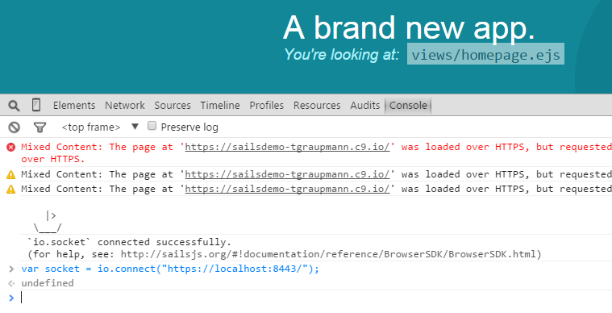

* Requesting leaderboard data uses the regular API while the data is logged in the `proxy`.

```
socket.request("/leaderboard", "{}", function (leaderboards) { console.log(leaderboards); });
```


* Open `SailsDebugSocketIO.sln` in `Visual Studio` as `Administrator` to run with enough permissions to start the `HttpListener` which by default runs on ports `8080` for `HTTP` and `8443` for `HTTPS`. Start the `proxy` server from `Visual Studio`.

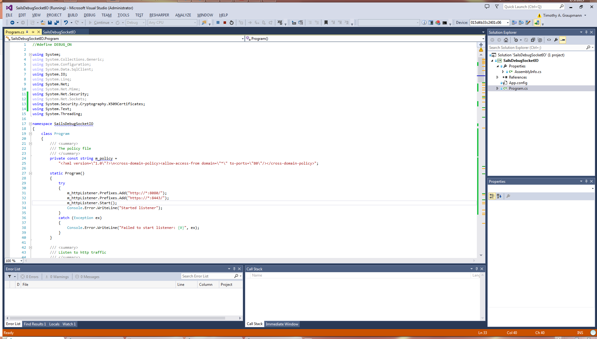

* Hosting `HTTPS` requires some certificate setup which can use self-assigned certs.
You will need to open the `Visual Studio Command Prompt` as `Administrator` to run with elevated permissions to install the certificates.
Start in an empty folder where you'll make the certificates.


* Create a `certificate authority` from the `Developer Command Prompt` running as `Administrator`.

```
makecert -n "CN=vMargeCA" -r -sv vMargeCA.pvk vMargeCA.cer
```


* Open the `Management Console` by running `Start->Run->` and enter `MMC`.

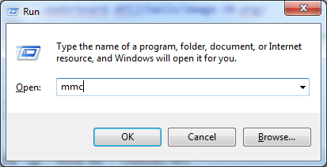

* Use the `File->Add/Remove Snap-in...` to customize the `MMC` snap-ins.

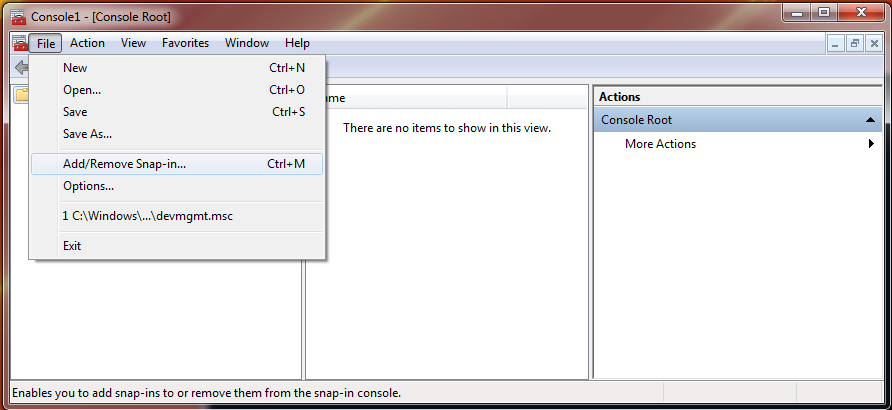

* Select `Certificates` and click the `Add` button.


* Choose `Computer account` and click the `Next` button.

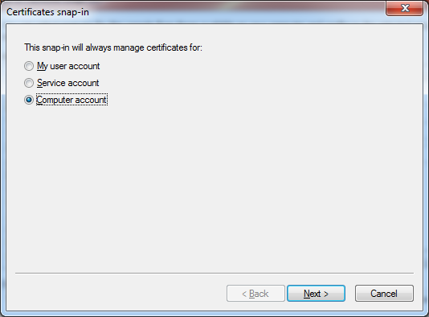

* Choose `Local computer` and click the `Finish` button.

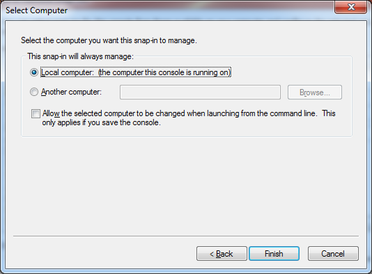

* Click the `OK` button.

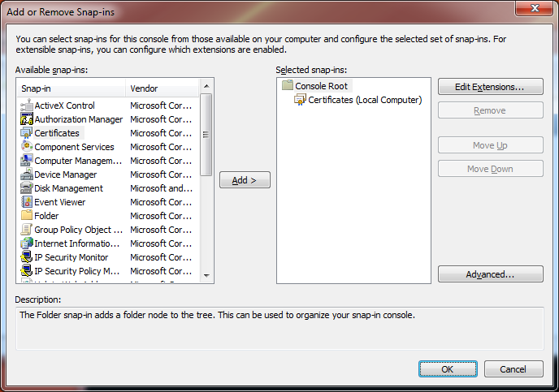

* Expand `Certificates (Local Computer)`. Expand `Trusted Root Certificate Authorities`.
`Right-Click` the `Certificates` subfolder and select the `All Tasks->Import...` menu item.

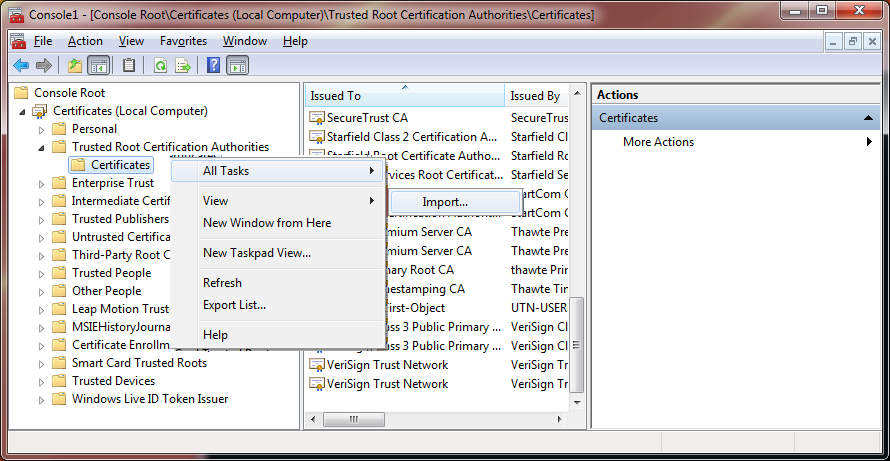

* Click the `Next >` button in the `Import Wizard`. 

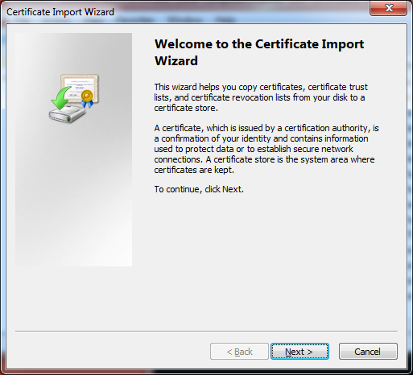

* Click the `Browse...` button in the `Import Wizard`.

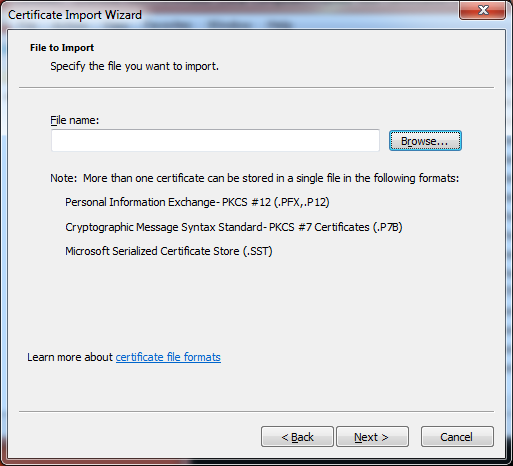

* Open the self-signed `vMargeCA.cer` certificate-authority file. 


* Click the `Next >` button in the `Import Wizard` to import the `certificate`.

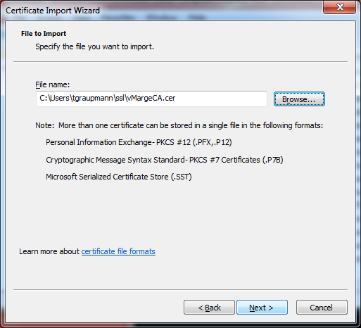

* Click the `Next >` button in the `Import Wizard` to add the `certificate` to the `Trusted Root Certification Authorities`.

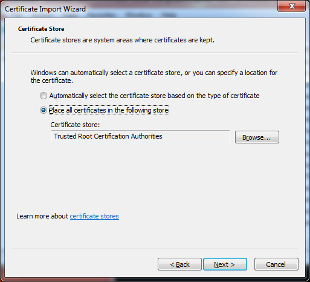

* Click the `Finish` button in the "Import Wizard".

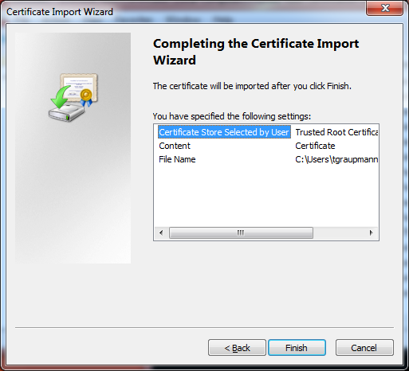

* Click the `OK` button to finish the import.

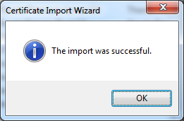

* Create a `certificate` to sign with the self certificate authority` from the `Developer Command Prompt` running as `Administrator`.

```
makecert -sk vMargeSignedByCA -iv vMargeCA.pvk -n "CN=vMargeSignedByCA" -ic vMargeCA.cer vMargeSignedByCA.cer -sr localmachine -ss My
```


* This will have automatically installed the self signed certificate in `Personal Certificates`.


* `Right-Click` the `vMargeSignedByCA` certificate in the `MMC` console and select `Open` menu item.


* Select the `Details` tab.


* Select `Properties Only` in the `Show` drop down.


* Select the `Thumbprint` property and copy the text to use the certificate. Remove all the whitespace. Your thumbprint will be different.

```
71e47da4b4661650eeabc138822d9be782a387ff
```


* In the `proxy` application in the `AssemblyInfo.cs` grab the `Guid` that uniquely defines the app to use with the `certificate`.

`218ad6b0-c657-462b-80d4-7b626a68c855`


* Use the `Thumbprint` property (without spaces) for the `certhash` and the `application guid` for the `appid`.
If you change the `port` of the `proxy` make sure that `ipport` uses that `port`.

```
netsh http add sslcert ipport=0.0.0.0:8443 certhash=71e47da4b4661650eeabc138822d9be782a387ff appid={218ad6b0-c657-462b-80d4-7b626a68c855}
```


* Restart the proxy and browse the `https://localhost:8443/` page in your browser and add a `security exception` to allow the self-signed `certificate`. 
