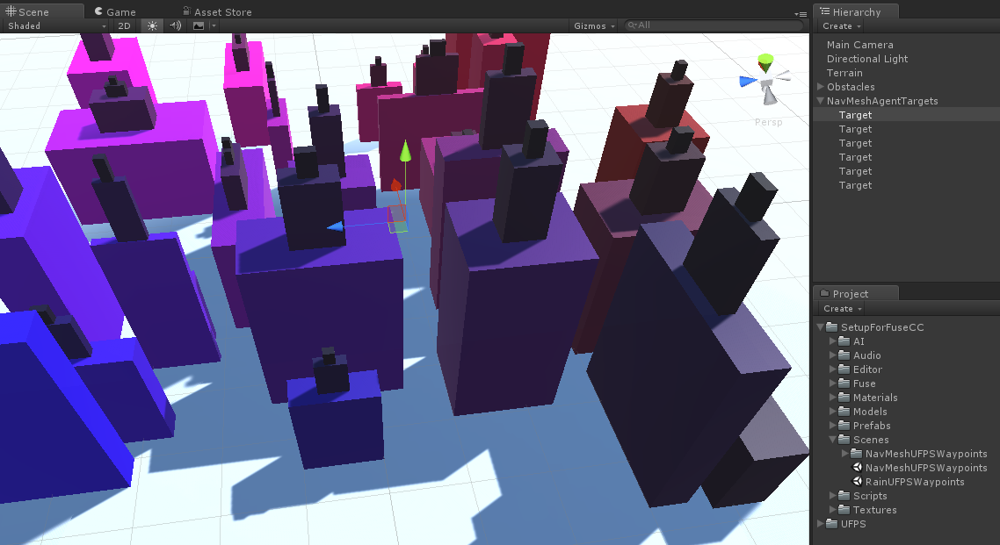
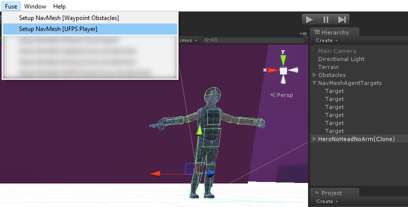
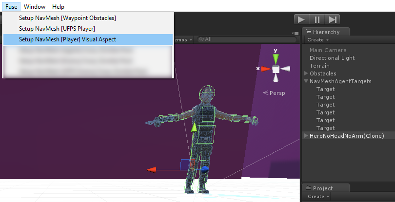

# Setup For Fuse CC
---

## Quick Links
---

Publisher: <a target=_blank href="http://tagenigma.com/blog">[TAGENIGMA Blog]</a>

## Feedback
---

Send your questions, feedback, or feature requests to [support@theylovegames.com](mailto:support@theylovegames.com).

## Audience
---

Anyone who wants to use [Adobe Fuse CC](http://www.adobe.com/products/fuse.html) to create characters and wants to use those chracters in [Unity](http://unity3d.com/) can use this package.

Anyone who used an existing character from [Mixamo.com](http://mixamo.com) and added the `Scary Zombie Animation Pack` to their character can use this package.

Anyone who uploaded models to [Mixamo.com](http://mixamo.com) and added the `Scary Zombie Animation Pack` to their character can use this package.

## Compatibility
---

This package is targeted for Unity 5.3.1 or better.

This package extends the Unity editor.

This package is compatible with [RAIN AI for Unity](https://www.assetstore.unity3d.com/en/#!/content/23569). 

This package is compatible with [UFPS : Ultimate FPS](https://www.assetstore.unity3d.com/en/#!/content/2943).

## What is in this package?
---

This package includes editor scripts that provide automatic setup via add menu items.

This package includes animated models that were created in `Adobe Fuse CC`.

## Tutorials
---

You will find detailed tutorial videos on our YouTube channel in the [Setup For Fuse CC Playlist](https://www.youtube.com/playlist?list=PL4mjXeDqRBMSgTOKGb8jpQ0tjgMV53VvN).

<table border=1>
 <tr>
 <td>Adobe Fuse CC to Unity UFPS (00:16:15) 
</td>
 <td></td>
 </tr>
</table>

## Example Scenes
---

Example scenes are located in `Assets/SetupForFuseCC/Scenes`.

Example Scene `RainUFPSWaypoints` - This example scene shows `RAIN` characters running around a `Navigation Mesh` cycling between waypoints. `RAIN` characters have a `Visual Sensor` and will detect players with a `Visual Aspect`. `RAIN` characters chase the player while in visual range. `RAIN` characters will attack the player when close enough. `RAIN` must be imported and enabled before opening this scene. `UFPS` must be imported and enabled before opening this scene.

Example Scene `NavMeshUFPSWaypoints` - This example scene shows `NavMesh Agents`  running around a terrain with obstacles and cycling between waypoints. `NavMesh Agents` have a `Visual Sensor` and will detect players with a `Visual Aspect`. `NavMesh Agents` chase the player while in visual range. `NavMesh Agents` will attack the player when close enough. `UFPS` must be imported and enabled before opening this scene.

## Enable RAIN AI for Unity
---

This package is compatible with [RAIN AI for Unity](https://www.assetstore.unity3d.com/en/#!/content/23569). 

The `RAIN AI for Unity` package must be imported before support is enabled.

To enable support, add `RAIN_AI` to the [Platform Custom Defines](http://docs.unity3d.com/Manual/PlatformDependentCompilation.html).

After support is enabled, `Fuse` submenu items will appear within the `RAIN` menu.

## Enable UFPS : Ultimate FPS
---

This package is compatible with [UFPS : Ultimate FPS](https://www.assetstore.unity3d.com/en/#!/content/2943).

The `UFPS` package must be imported before support is enabled.

To enable support, add `UFPS` to the [Platform Custom Defines](http://docs.unity3d.com/Manual/PlatformDependentCompilation.html).

After support is enabled, `UFPS` submenu items will appear within the `Fuse` menu.

## Unity Built-in NavMesh Agents
---

### Getting Started

#### Create a New Scene

Start with a new scene and save the scene. A scene has to be saved to bake a `NavMesh`.

#### Create Waypoint Obstacles

The menu item `Fuse->Setup NavMesh [Waypoint Obstacles]` automatically creates a terrain with obstacles and waypoints. Obstacles show that the `NavMesh Agents` can navigate the `NavMesh` while patrolling a set of `Waypoints`.

Terrain provides a floor to walk on. Obstacles are a set of cubes shaped like buildings spaced apart to give room for the `NavMesh Agents` to avoid. The obstacles are colored to make navigating the scene easy while inspecting `NavMesh Agents`. The `NavMeshAgentTargets` are a set of `GameObjects` to be used as patrol `Waypoints`.

#### Setup the UFPS Player

The menu item `Fuse->Setup NavMesh [UFPS Player]` is only available when `UFPS` is enabled. The menu item creates a `UFPS` player with a `Visual Aspect` for `NavMesh Agents` to sense. The `UFPS` player has a `first-person` controller and is capable of running around the obstacle course. The `UFPS` has the damage handlers, colliders, and a starting inventory already setup. Since `UFPS` players have their own cameras, the default `Main Camera` is disabled. At this point, the player can run around the scene and shoot.

#### Setup the Player

The menu item `Fuse->Setup NavMesh [Player] Visual Aspect` adds a `Visual Aspect` to the player so that `NavMesh Agents` can detect the player. This can be used on `UFPS` players or generically on something like the `Standard Assets` where a `Character Controller` was used. A `Visual Aspect` will work for a `first-person` or `third-person` perspective controller.

## RAIN AI for Unity
---

#### Create a New Scene

Start with a new scene and save the scene.

## Change Log
---

1.0 - Initial submission of package.

## Q & A
---

You can send comments/questions to [support@theylovegames.com](mailto:support@theylovegames.com) where your feedback will help us create new tutorials and features in order to improve the product.
